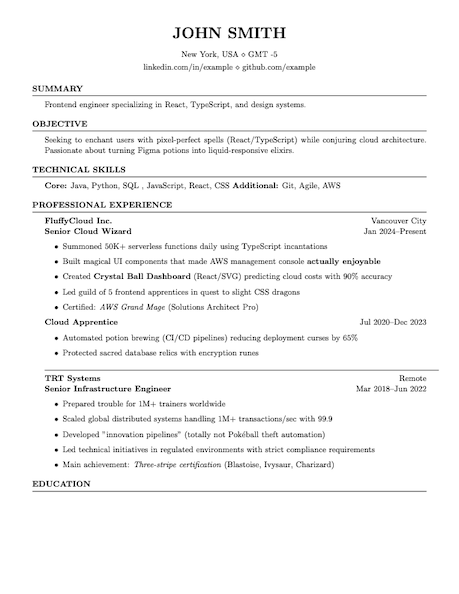

# ChameLaTeX: Your CV That Adapts Like Magic

🦎 A LaTeX CV that adapts to its environment.  
Generate targeted resumes from one source -- like a chameleon changes colors for camouflage.  

[](https://creativecommons.org/licenses/by-nc-sa/4.0/)  
*"Your resume shouldn’t be one-size-fits-all"*  

🦎 One Source, Many Morphs:
Generate variants based on flags and conditionals instantly -— no manual tweaking.

🌿 Branch Like a Pro:
Git branches let you maintain flavours (like company-specific versions) seamlessly.

Built on the [Medium Length Professional CV](https://www.latextemplates.com/template/medium-length-professional-cv) template from LaTeX Templates.




## Quick Start

### Prerequisites

- LaTeX distribution (TeX Live, MiKTeX, etc.) - `pdflatex` command available in PATH
- Git
- Bash shell

### Basic Usage

```bash
# Build all CV variants
% make
% ls -R output
output -> output_2025-05-31_04-52-19
├── JohnDoe_CV.pdf
├── public/
│   └── JohnDoe_CV.pdf
│   └── JohnDoe_CV_frontend.pdf
├── frontend/
│   └── JohnDoe_CV.pdf
└── acmecorp/
    └── JohnDoe_CV.pdf
```

## Configuration

The system generates multiple CV versions configured in `build.sh`:

```bash
readonly BUILD_CONFIGS=(
  # "{branch} {output_file.pdf} {flag1} {flag2}"
  "main JohnDoe_CV.pdf"
  "main public/JohnDoe_CV.pdf public"
  "main frontend/JohnDoe_CV.pdf frontend"
  "main public/JohnDoe_CV_frontend.pdf frontend public"
  "acmecorp acmecorp/JohnDoe_CV.pdf"
  # Add your new configuration here
)
```

In this example:

| Variant | Target Path | Flags | Description |
|---------|-------------|-------|-------------|
| Main    | `JohnDoe_CV.pdf` | _(none)_ | Default CV with full details |
| Public  | `public/JohnDoe_CV.pdf` | `public` | Minimal public version without detailed info |
| Frontend | `frontend/JohnDoe_CV.pdf` | `frontend` | Skill focused CV |
| Public & Frontend | `public/JohnDoe_CV_frontend.pdf` | `frontend`, `public` | Multiple flags: skill focused and public |
| AcmeCorp | `acmecorp/JohnDoe_CV.pdf` | `frontend` | Company-specific version built from `acmecorp` branch |

### Conditional Flags

Content can be conditionally included using flags.

1. Add the flag definition in `main.tex`:
```latex
\newif\ifnewflag
\newflagfalse
```

2. Use the flag in your content:
```latex
\ifnewflag
Content for new flag
\else
Alternative content without new flag.
\fi
```

3. Add to BUILD_CONFIGS
```bash
"main new/JohnDoe_CV.pdf newflag"
```

### Branch-based Builds

Instead of using flags, simply leverage git branches for multiple versions of your CV:
```bash
git checkout main
# In BUILD_CONFIGS in build.sh main branch, specify a new branch config:
# "acmecorp acmecorp/JohnDoe_CV.pdf frontend"
# create the branch
git branch -b acmecorp
# modify tex
 sed -i '' 's/Seeking/Seeking a senior software developer role at Acme Corporations/g' objective.tex

git commit -m "Custom objective for AcmeCorp role"
git checkout main

make
ls ./output/acmecorp/JohnDoe_CV.pdf
./output/acmecorp/JohnDoe_CV.pdf
```

It builds from the `acmecorp` branch, allowing you to maintain company-specific content (like tailored project descriptions, relevant technologies, or specific achievements) in a separate branch while keeping your main CV clean.

This uses git worktree to avoid disrupting your current working directory.

## Project Structure

```
├── main.tex           # Main LaTeX document
├── header.tex         # Header information
├── summary.tex        # Summary section
├── objective.tex      # Career objective
├── skills.tex         # Skills section
├── experience.tex     # Work experience
├── education.tex      # Education section
├── build.sh          # Build script
├── Makefile          # Make wrapper
└── output/           # Symlink to latest build (auto-generated)
```

## Advanced

### Build Process
1. **Setup**: Creates timestamped output directory
2. **Branch handling**: Switches to specified git branch if needed (uses git worktree)
3. **Flag generation**: Creates `flags.tex` with enabled flags
4. **PDF generation**: Runs `pdflatex` to generate PDF
5. **Cleanup**: Removes temporary LaTeX files
6. **Symlinking**: Creates `output` symlink to latest build
### Error Handling
- LaTeX error reporting with log excerpts
- Graceful handling of missing branches
## Troubleshooting
- Clean up with `./build.sh clean`
**Build fails with LaTeX errors:**
- Check `main.log` for detailed LaTex error information
**Git worktree errors:**
- Ensure specified branches exist and use `make clean`
- Double-check if branches in use need rebasing your last fix.
### Debug Mode
For verbose output, make errors print in standard output in `build.sh`:
```bash
pdflatex -interaction=nonstopmode main.tex  # Remove >/dev/null 2>&1
```
## Contributing
1. Test changes with `./build.sh build`
2. Verify all example variants generate correctly
3. Update this README for new features
4. Use meaningful commit messages for version tracking

## License

This project is released under the CC BY-NC-SA 4.0 License.

This project is based on the [Medium Length Professional CV](https://www.latextemplates.com/template/medium-length-professional-cv) template from LaTeX Templates.